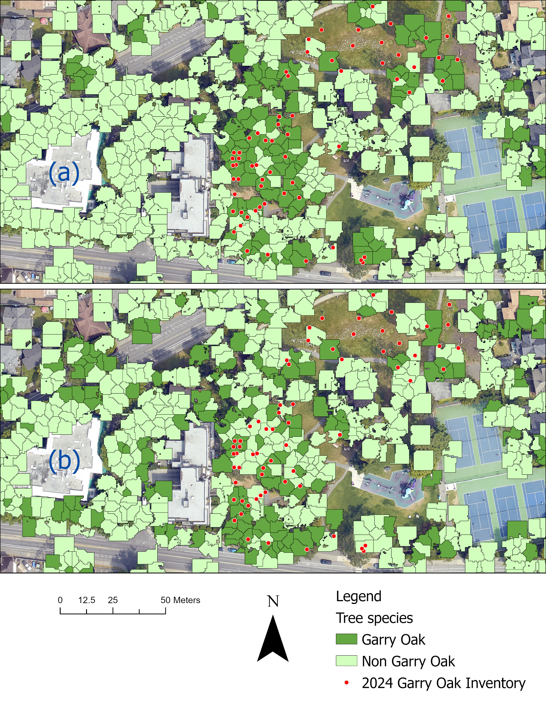

## Project Summary

This project mapped Garry oak trees in Victoria using remote sensing data.  
I used LiDAR, orthophotos, and Random Forest models to detect Garry oak crowns.

## Why It Matters

Garry oak is an important native species.  
This project shows how remote sensing can help map it more efficiently.

## Data and Methods

I used LiDAR data, 4-band orthophotos, and ground truth reference data.  
I built two models:
1.  - LiDAR-only
2.  - Fusion (LiDAR + orthophoto)

## Workflow designs
Data processing → feature extraction → modelling → validation → mapping

## Model Performance

The LiDAR-only model worked reasonably well.  
The fusion model performed better overall.

## Key Result

Adding orthophoto information improved Garry oak detection.  
The fusion model gave more accurate results than the LiDAR-only model.

## Garry oak detection map representation

Description: Expected Garry Oak crown classification maps: (a) Fusion model (LiDAR + 4 band orthophoto), (b) LiDAR-only. Deep green polygons show predicted Garry Oak, light green polygons show predicted non-Garry Oak, and red points are the 2024 Garry Oak inventory.
